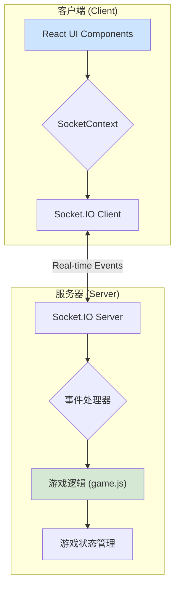

# 在线德州扑克游戏 (Texas Hold'em Poker Game)

一个使用React和Node.js构建的、功能完善的在线多人德州扑克游戏。项目采用现代Web技术栈，实现了完整的游戏逻辑、实时的玩家交互和友好的用户界面。

## ✨ 功能特点

- **完整的德州扑克规则**: 实现了包括盲注、翻牌、转牌、河牌、下注、跟注、加注、弃牌和比牌在内的全套德州扑克逻辑。
- **多人在线实时对战**: 基于 WebSocket 技术，支持多名玩家在同一房间内进行实时游戏。
- **会话恢复与重连**: 支持玩家在意外断线后自动重连到原房间，保持游戏连续性。
- **连接状态监控**: 实时显示连接状态，在网络异常时提供可视化反馈。
- **灵活的房间管理**: 支持创建、加入和主动退出房间，玩家可以自由控制游戏参与状态。
- **美观的现代化UI界面**: 使用 React 和 CSS3 精心设计的游戏界面，包含卡牌、筹码、玩家状态等元素。
- **流畅的动画效果**: 通过CSS动画和React组件状态管理，实现了发牌、下注、收池等过程的流畅视觉效果。
- **游戏音效支持**: 为关键游戏事件（如下注、发牌、获胜）配备了音效，提升游戏沉浸感。
- **实时聊天功能**: 内置聊天框，方便玩家在游戏过程中进行交流。
- **响应式设计**: 界面适配不同尺寸的屏幕，支持在移动设备上进行游戏。

## 🚀 技术栈

| 分类 | 技术 | 描述 |
| :--- | :--- | :--- |
| **前端** | React 18+ | 用于构建用户界面的声明式JavaScript库。 |
| | Vite | 现代化的前端构建工具，提供极速的开发体验。 |
| | Socket.IO Client | 实现客户端与服务器之间的实时、双向通信。 |
| | CSS3 | 用于样式设计和动画效果。 |
| **后端** | Node.js | JavaScript 运行时，用于构建可扩展的网络应用。 |
| | Express | 简洁而灵活的 Node.js Web 应用框架。 |
| | Socket.IO | 实现服务器与客户端之间的实时、双向通信。 |
| | `poker-evaluator` | 用于评估和比较德州扑克手牌大小的库。 |
| **部署** | Docker | (可选) 用于容器化部署后端服务。 |

## 🏛️ 系统架构

项目采用经典的 **客户端-服务器 (Client-Server)** 架构，通过 **WebSocket** 进行实时通信。

### 整体架构图



### 后端 (Server)

后端使用 Node.js 和 Express 构建，核心通信层由 Socket.IO 实现。

- **`index.js` (服务器入口)**:
    - 初始化 Express 应用和 HTTP 服务器。
    - 启动 Socket.IO 服务器并配置 CORS 策略，以允许跨域连接。
    - 管理游戏房间 (`rooms` Map)，处理房间的创建、加入和玩家断开连接的逻辑。
    - 作为事件分发中心，监听来自客户端的各种事件（如 `createRoom`, `playerAction`），并调用相应的游戏逻辑。
    - 广播游戏状态更新 (`gameStateUpdate`) 给房间内的所有玩家。

- **`game.js` (核心游戏逻辑)**:
    - **`Game` 类**: 这是游戏的核心，一个强大的状态机，负责管理一局游戏的完整生命周期。
        - **状态管理**: 维护游戏状态 (`gameState`)，包括 `WAITING`, `PREFLOP`, `FLOP`, `TURN`, `RIVER`, `SHOWDOWN`。
        - **玩家动作处理**: 包含处理 `fold`, `call`, `raise` 等玩家行为的核心方法 (`playerAction`)。
        - **游戏流程控制**: 自动化处理发牌、下盲注、轮转玩家顺序、进入下一轮下注、处理边池 (`sidePots`) 和最终的摊牌 (`showdown`)。
    - **`Player` 类**: 对玩家数据进行建模，包含 `id`, `nickname`, `chips` (筹码), `hand` (手牌), `status` (状态) 等属性。
    - **`Deck` 和 `Card` 类**: 实现了标准的扑克牌和牌堆逻辑，包括创建、洗牌和发牌。

### 前端 (Client)

前端是一个使用 Vite 构建的 React 单页应用 (SPA)。

- **组件化设计**: UI被拆分为一系列可复用的React组件，如 `GameTable`, `Player`, `CommunityCards`, `ActionBar` 等，每个组件负责渲染游戏的一部分。
- **状态管理**:
    - **`SocketContext.jsx`**: 这是前端状态管理的核心。它通过 React Context API 向整个应用提供一个全局的 `socket` 实例和集中的游戏状态。
    - 所有从服务器接收到的游戏状态 (`gameStateUpdate`) 都会在这里被处理，并更新到全局状态中，从而驱动UI的重新渲染。
    - 这种设计将通信逻辑与UI组件解耦，使得组件本身更加纯粹和易于管理。
- **自定义 Hooks**:
    - **`useGameSounds`**: 监听 `gameState` 的变化，在特定事件发生时（如轮到玩家行动、有人下注）播放对应的音效。
    - **`useGlobalMessages`**: 监听游戏状态变化，用于显示全局的提示信息（如 "Check", "Raise"）。
- **`GameTable.jsx`**: 作为顶层UI容器，它根据当前的 `gameState` (例如，是在等待大厅、游戏中还是显示结果) 来动态渲染不同的视图。

## 📡 通信协议

客户端和服务器之间通过一套定义好的 Socket.IO 事件进行通信。

| 事件名称 | 发送方 | 接收方 | 描述 |
| :--- | :--- | :--- | :--- |
| `createRoom` | Client | Server | 玩家请求创建一个新房间。 |
| `joinRoom` | Client | Server | 玩家请求加入一个现有房间。 |
| `leaveRoom` | Client | Server | 玩家请求退出当前房间。 |
| `attemptReconnect` | Client | Server | 玩家尝试重新连接到之前的房间。 |
| `startGame` | Client | Server | 房主请求开始游戏。 |
| `playerAction` | Client | Server | 玩家执行一个游戏动作（如跟注、加注）。 |
| `sendMessage` | Client | Server | 玩家发送一条聊天消息。 |
| `gameStateUpdate` | Server | Client | 服务器向房间内所有客户端广播最新的游戏状态。 |
| `dealPrivateCards`| Server | Client | 服务器向特定玩家发送其私有手牌。 |
| `handResult` | Server | Client | 服务器广播一手牌的最终结果（获胜者、牌型等）。 |
| `leftRoom` | Server | Client | 服务器确认玩家已成功退出房间。 |
| `reconnectSuccess` | Server | Client | 服务器确认玩家重连成功。 |
| `reconnectFailed` | Server | Client | 服务器通知玩家重连失败。 |
| `playerDisconnected` | Server | Client | 服务器通知房间内玩家某人暂时离线。 |
| `error` | Server | Client | 服务器向特定玩家发送错误信息。 |

## 📦 项目结构

```
texasholdem/
├── client/          # React前端应用
│   ├── src/
│   │   ├── components/  # React组件 (Player, Card, ActionBar...)
│   │   ├── contexts/    # React上下文 (SocketContext)
│   │   ├── hooks/       # 自定义Hooks (useGameSounds)
│   │   └── utils/       # 工具函数
│   └── public/      # 静态资源
├── server/          # Node.js后端服务
│   ├── index.js     # 服务器入口和Socket.IO事件处理
│   ├── game.js      # 核心游戏逻辑和状态机
│   └── Dockerfile   # Docker配置
└── README.md
```

## 🚀 快速开始

### 环境要求

- Node.js 16+
- npm 或 yarn

### 安装和运行

1.  **克隆仓库**
    ```bash
    git clone https://github.com/your-username/texasholdem.git
    cd texasholdem
    ```

2.  **安装后端依赖并启动服务器**
    ```bash
    cd server
    npm install
    npm run dev
    ```
    服务器将运行在 `http://localhost:3000`。

3.  **安装前端依赖并启动客户端**
    ```bash
    cd ../client
    npm install
    npm run dev
    ```
    客户端将在 `http://localhost:5173` 启动，并自动在浏览器中打开。

4.  **开始游戏**
    - 在浏览器中打开两个或多个标签页，分别输入不同的昵称。
    - 第一个玩家创建房间，并将房间ID分享给其他玩家。
    - 其他玩家使用房间ID加入。
    - 房主点击“开始游戏”即可享受德州扑克的乐趣！

### Docker 部署

如果你希望使用 Docker 部署后端服务：

```bash
cd server
docker build -t texasholdem-server .
docker run -p 3000:3000 texasholdem-server
```

## 💡 未来可以探索的方向

- **用户认证与数据持久化**: 集成数据库（如 MongoDB 或 PostgreSQL），实现用户注册、登录和游戏数据的持久化。
- **更丰富的游戏设置**: 允许房主自定义盲注大小、初始筹码、游戏速度等。
- **锦标赛模式**: 增加淘汰赛或积分赛等更复杂的游戏模式。
- **AI 玩家**: 实现可以与真人玩家对战的AI机器人。
- **单元测试与集成测试**: 为 `game.js` 的核心逻辑编写单元测试，确保其稳定性和正确性。

## 🤝 贡献

欢迎提交Issue和Pull Request来改进这个项目！

## 📄 许可证

MIT License