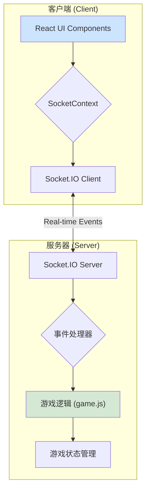

# 在线德州扑克游戏 (Texas Hold'em Poker Game)

一个使用React和Node.js构建的、功能完善的在线多人德州扑克游戏。项目采用现代Web技术栈，实现了完整的游戏逻辑、实时的玩家交互和友好的用户界面。

## ✨ 功能特点

- **完整的德州扑克规则**: 实现了包括盲注、翻牌、转牌、河牌、下注、跟注、加注、弃牌和比牌在内的全套德州扑克逻辑。
- **多人在线实时对战**: 基于 WebSocket 技术，支持多名玩家在同一房间内进行实时游戏。
- **会话恢复与重连**: 支持玩家在意外断线后自动重连到原房间，保持游戏连续性。
- **连接状态监控**: 实时显示连接状态，在网络异常时提供可视化反馈。
- **灵活的房间管理**: 支持创建、加入和主动退出房间，玩家可以自由控制游戏参与状态。
- **现代牌室双主题**: 提供低饱和牌桌绿、暖金点缀的白天和夜间主题，包含完整的多端牌桌、结算与排行榜界面。
- **克制且可访问的动效**: 统一状态切换、弹层和消息动效，并支持 `prefers-reduced-motion`。
- **游戏音效支持**: 为关键游戏事件（如下注、发牌、获胜）配备了音效，提升游戏沉浸感。
- **实时聊天功能**: 内置聊天框，方便玩家在游戏过程中进行交流。
- **响应式设计**: 界面适配不同尺寸的屏幕，支持在移动设备上进行游戏。

## 🚀 技术栈

| 分类 | 技术 | 描述 |
| :--- | :--- | :--- |
| **前端** | React 18+ | 用于构建用户界面的声明式JavaScript库。 |
| | Vite | 现代化的前端构建工具，提供极速的开发体验。 |
| | Socket.IO Client | 实现客户端与服务器之间的实时、双向通信。 |
| | CSS3 | 用于样式设计和动画效果。 |
| **后端** | Node.js | JavaScript 运行时，用于构建可扩展的网络应用。 |
| | Express | 简洁而灵活的 Node.js Web 应用框架。 |
| | Socket.IO | 实现服务器与客户端之间的实时、双向通信。 |
| | `poker-evaluator` | 用于评估和比较德州扑克手牌大小的库。 |
| **部署** | Docker | (可选) 用于容器化部署后端服务。 |

## 🏛️ 系统架构

项目采用经典的 **客户端-服务器 (Client-Server)** 架构，通过 **WebSocket** 进行实时通信。

### 整体架构图


```mermaid
graph TD
    subgraph "客户端 (Client)"
        A["React UI Components"] --> B{"SocketContext"};
        B --> C["Socket.IO Client"];
    end

    subgraph "服务器 (Server)"
        D["Socket.IO Server"] --> E{"事件处理器"};
        E --> F["游戏逻辑 (game.js)"];
        F --> G["游戏状态管理"];
    end

    C <-- "Real-time Events" --> D;

    style A fill:#cde4ff
    style F fill:#d5e8d4
```

### 后端 (Server)

- `index.js`：HTTP / Socket.IO 适配层，处理连接与命令确认。
- `room-service.js`：房间、稳定玩家身份、场次、行动期限、自动续局和房主交接的统一入口，支持注入时钟测试。
- `game.js`：发牌、下注、盲注、边池、摊牌与筹码结算。

### 前端 (Client)

`SessionClient` 分开处理网络连接和身份恢复，以完整权威快照更新 `SocketContext`。`GameTable` 协调欢迎、连接、大厅和牌桌；`useTableSequencer` 只负责展示动画，重连时丢弃旧队列。牌桌常驻自动续局、暂停、回到牌桌和查看上一手入口。

## 📡 通信与恢复

当前使用协议 v2：`resumeSession` 恢复稳定身份，`roomSnapshot` 一次性同步公开状态和对应玩家的私有状态；命令带请求标识与连接代次，下注还需匹配手牌及行动标识。断线不重置行动期限，结算后默认 8 秒自动续局，房主断线 30 秒后交接。离线成员保留本场身份和筹码。

完整协议、状态转换、配置、发布限制与验证命令见 [状态与会话协议 v2](docs/STATE_AND_SESSION.md)，实机操作见 [重连验收指南](RECONNECT_TEST_GUIDE.md)。前后端需同步升级；本轮不支持服务端重启后恢复内存牌局。

## 📦 项目结构

```
texasholdem/
├── client/          # React前端应用
│   ├── src/
│   │   ├── screens/     # 欢迎、连接、大厅和游戏页面
│   │   ├── components/  # 游戏、聊天与基础 UI 组件
│   │   ├── contexts/    # React上下文 (SocketContext)
│   │   ├── hooks/       # ViewModel、聊天、音效与消息 Hooks
│   │   ├── styles/      # 白天/夜间设计令牌
│   │   └── dev/         # 确定性 UI 预览 fixture
│   └── public/      # 静态资源
├── server/          # Node.js后端服务
│   ├── index.js     # HTTP / Socket.IO 适配
│   ├── room-service.js # 房间、身份、场次与定时任务
│   ├── game.js      # 核心游戏逻辑和状态机
│   └── Dockerfile   # Docker配置
└── README.md
```

## 🚀 快速开始

### 环境要求

- Node.js 22.13+（本地已在 Node.js 26 验证）
- npm 或 yarn

### 安装和运行

1.  **克隆仓库**
    ```bash
    git clone https://github.com/YinChingZ/texasholdem.git
    cd texasholdem
    ```

2.  **安装后端依赖并启动服务器**
    ```bash
    cd server
    npm install
    npm run dev
    ```
    服务器将运行在 `http://localhost:3000`。

3.  **安装前端依赖并启动客户端**
    ```bash
    cd ../client
    npm install
    npm run dev
    ```
    客户端将在 `http://localhost:5173` 启动，并自动在浏览器中打开。

4.  **开始游戏**
    - 在浏览器中打开两个或多个标签页，分别输入不同的昵称。
    - 第一个玩家创建房间，并将房间ID分享给其他玩家。
    - 其他玩家使用房间ID加入。
    - 房主点击“开始游戏”即可享受德州扑克的乐趣！

### 界面验收

开发模式下访问 `http://localhost:5173/?uiPreview=__index__` 查看固定场景。新界面默认深色，已有主题偏好仍然保留；详细测试和手机适配说明见 [UI_REFACTOR_ACCEPTANCE.md](UI_REFACTOR_ACCEPTANCE.md) 与 [MOBILE_ADAPTATION.md](MOBILE_ADAPTATION.md)。

### Docker 部署

如果你希望使用 Docker 部署后端服务：

```bash
cd server
docker build -t texasholdem-server .
docker run -p 3000:3000 texasholdem-server
```

## 💡 未来可以探索的方向

- **用户认证与数据持久化**: 集成数据库（如 MongoDB 或 PostgreSQL），实现用户注册、登录和游戏数据的持久化。
- **更丰富的游戏设置**: 允许房主自定义盲注大小、初始筹码、游戏速度等。
- **锦标赛模式**: 增加淘汰赛或积分赛等更复杂的游戏模式。
- **AI 玩家**: 实现可以与真人玩家对战的AI机器人。
- **扩展跨浏览器自动化**: 当前以 Chromium 为主，可继续增加 WebKit、Firefox 与真机流水线。

## 🤝 贡献

欢迎提交Issue和Pull Request来改进这个项目！

## 📄 许可证

MIT License
