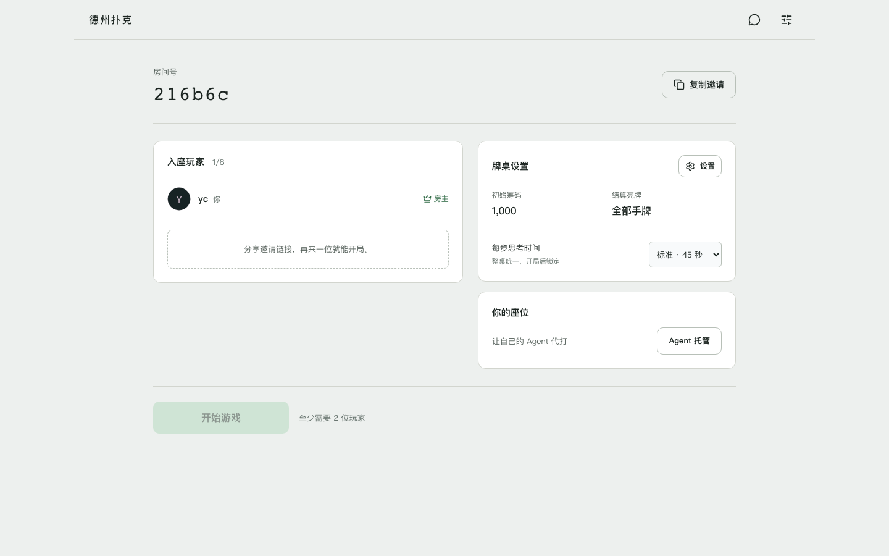

# 德州扑克 · Texas Hold’em

一个支持朋友同桌、单人观察练习和自带 Agent 托管的在线德州扑克网站。使用虚拟筹码，无需注册账号；玩家通过浏览器身份恢复原座位。

**[在线游玩](https://texasholdem.top)** · **[Agent 快速接入](docs/AGENT_QUICKSTART.md)** · **[观察练习](docs/OBSERVATION_TRAINING.md)** · **[开发与协议](docs/STATE_AND_SESSION.md)**



## 三种玩法

### 和朋友同桌

输入昵称创建房间，把邀请链接发给朋友，也可以通过房间号加入。普通房间最多 8 个玩家座位，至少 2 位玩家才能开局，支持旁观和聊天。

- **牌局规则**：盲注、翻牌、转牌、河牌、过牌、跟注、加注、弃牌、全押、边池与摊牌结算。
- **开局设置**：初始筹码 500–50,000，默认 1,000；结算显示全部手牌或仅赢家；整桌行动时间 45 秒或 120 秒，开局后锁定至重置。
- **连续游戏**：默认结算后 8 秒自动续局，支持暂停、结束本场、重新准备和查看上一手结算。场内筹码排名用于本场回顾。
- **离线处理**：行动超时自动过牌或弃牌，连续两次超时进入暂离；恢复后可回到牌桌。房主断线默认 30 秒后交接。
- **页面体验**：桌面与手机布局、明暗主题、发牌与派彩动画、音效、聊天抽屉和减少动态效果支持。准备页集中展示玩家、设置和自己的座位操作。

建议不同玩家使用独立浏览器配置或设备。同一浏览器中打开同一房间可能恢复已有身份，不一定创建新玩家。

### 单人观察练习

首页选择 **观察练习**，与三名风格隐藏的规则电脑进行 20 手练习。每手重新分配 1,000 筹码，盲注 5/10；真人没有行动倒计时。

- 记录对手行为、判断与把握程度，第 5、10、15 手提供阶段观察提示。
- 可暂停；断线时自动暂停；弃牌后可快速看完本手。
- 实时教练解释投入、底池门槛、牌面风险与公开行动样本，反馈按当时信息保存。
- 结束后查看证据复盘，额外底牌和后续结果需要主动揭示。
- 报告保存在当前浏览器 IndexedDB，保留最近 20 份，支持 JSON 下载。

电脑策略和实时教练基于规则，旨在帮助观察与理解，不是专业扑克求解器，也不提供最优行动保证。详见 [训练说明](docs/OBSERVATION_TRAINING.md)。

### 让自己的 Agent 代打

支持 **Codex 桌面客户端、Claude Code、DeepSeek Harness**，以及兼容 Streamable HTTP MCP 的其他客户端。

1. **首次添加牌桌工具**：在客户端添加名称为 `holdem` 的远程 MCP。
2. **网页取得座位**：创建或加入普通房间，打开 **Agent 托管 → 生成配对码**。
3. **发出连接指令**：点击 **复制连接指令**，粘贴给 Agent；连接成功后开始代打。

远程 MCP 地址：

```text
https://texasholdem-elub.onrender.com/mcp
```

Claude Code 首次配置：

```sh
claude mcp add --transport http --scope user holdem https://texasholdem-elub.onrender.com/mcp
```

Codex 可以直接在桌面客户端设置中添加远程 MCP，无需安装 Codex CLI。三种客户端的详细步骤见 [Agent 快速开始](docs/AGENT_QUICKSTART.md)。

**玩家无需下载源码、安装本地适配器或向网站提供模型密钥。** 配对码 5 分钟有效且只能兑换一次；Agent 后续使用工具返回的秘密座位凭据，玩家不必手动保存。不要分享含该凭据的完整工具日志。

托管期间网页继续显示本人底牌，随时可 **接回操作**。重新授权、接管、离桌或场次结束会撤销旧授权；最长有效 24 小时。远程 Agent 请求刷新 90 秒活跃期限，须持续观察、等待与行动；网站不会唤醒已经结束的 Harness 任务。网页生成的指令默认最多完成 20 手。

当前 MCP 控制的是**已授权座位**，不提供自动找房、自由入座或房主管理权限，也不接入单人训练。需要直接集成时，另有 HTTP API v1、本地 STDIO MCP、JavaScript 客户端和 Python 示例。

## 本地运行

推荐 Node.js 22.13+ 与 npm，本机也已在 Node.js 26 验证。仓库的前端、后端与 Agent 目录分别安装依赖。

```sh
git clone https://github.com/YinChingZ/texasholdem.git
cd texasholdem
npm ci --prefix server
npm ci --prefix client
```

终端一，启动游戏后端：

```sh
AGENT_ENABLED=true npm --prefix server start
```

终端二，启动前端：

```sh
npm --prefix client run dev
```

打开 `http://localhost:5173`。后端默认 `http://localhost:3000`，本地 MCP 地址为 `http://localhost:3000/mcp`。不需要托管功能时可以省略 `AGENT_ENABLED=true`，其默认值为关闭。

仅在使用本地 STDIO MCP、JS 示例或 Agent 集成测试时安装：

```sh
npm ci --prefix agent
```

开发模式下访问 `http://localhost:5173/?uiPreview=__index__` 可查看固定 UI 场景；生产构建不提供这个预览入口。

## 部署

当前仓库的生产配置采用 **Vercel 前端 + Render 游戏后端**：

| 部分 | 配置 |
|---|---|
| Vercel | 项目根目录 `client`，构建 `npm run build`，输出 `dist` |
| 前端 API 地址 | `VITE_API_URL=https://texasholdem-elub.onrender.com`，在构建时生效 |
| Render | 服务根目录 `server`，安装 `npm ci`，启动 `npm start` |
| Agent 开关 | 在 **Render 后端**设置 `AGENT_ENABLED=true`，不是只设置 Vercel |
| 健康检查 | `GET /health` |
| 远程 MCP | `POST /mcp`，与游戏后端部署在一起 |

自建部署需要让域名和 `server/index.js` 中的来源白名单一致，生产请求使用 HTTPS，并支持 Socket.IO 和最长 25 秒的 Agent 等待请求。开发代理目标可通过 `DEV_API_URL` 调整。

后端常用参数：

| 环境变量 | 默认值 | 用途 |
|---|---:|---|
| `PORT` | `3000` | HTTP / Socket.IO / MCP 共用端口 |
| `AGENT_ENABLED` | `false` | 开启 Agent 托管与远程 MCP |
| `TURN_TIMEOUT_MS` | `45000` | 新房间默认行动时间；网页支持 45 / 120 秒 |
| `NEXT_HAND_MS` | `8000` | 普通房间结算后续局间隔 |
| `PACING_MS` | `600` | 自动发公共牌节奏 |
| `HOST_GRACE_MS` | `30000` | 房主断线交接宽限 |
| `SESSION_PROBE_MS` | `3000` | 浏览器身份恢复时的旧连接探测 |
| `ROOM_IDLE_MS` | `1800000` | 全员离线后的房间回收时间 |

前后端协议相关改动需配套发布。服务重启会清空房间和授权，应安排在没有活跃牌局时进行。运行中向服务发送 `SIGHUP` 会关闭 Agent 功能并撤销现有授权；重新开放需要以开启的环境变量启动服务。

## 架构与代码导航

前端使用 **React 19、Vite 6、Socket.IO Client 和 CSS Modules**；后端使用 **Node.js、Express 5、Socket.IO、poker-evaluator、Ajv 和官方 MCP SDK**。

所有游戏写操作由 `RoomService` 同步处理。浏览器 Socket.IO v2、HTTP Agent API v1 和远程 MCP 共用身份、授权、规则、截止时间与幂等检查，不通过伪造浏览器连接接入 Agent。

| 路径 | 职责 |
|---|---|
| `server/game.js` | 扑克规则、合法操作、下注、边池与结算 |
| `server/room-service.js` | 房间、稳定成员身份、场次推进、定时任务与快照 |
| `server/agent-service.js` | 配对、座位授权、活跃状态、观察与幂等行动 |
| `server/agent-http.js` / `agent-mcp.js` | HTTP v1 与远程 MCP 适配层 |
| `server/agent-schema.json` | 共享接口 Schema；执行时完整校验 |
| `server/training*.js` | 单人练习、规则电脑、观察报告及教练 |
| `client/src/services/sessionClient.js` | 连接、身份恢复、确认与权威快照 |
| `client/src/screens/` | 首页、恢复页、准备页和牌桌 |
| `client/src/hooks/useTableSequencer.js` | 展示动画队列；恢复时丢弃旧动画 |
| `client/src/components/game/AgentPanel.jsx` | 托管、首次配置、配对与人工接管 |
| `agent/` | 本地 STDIO MCP、JS / Python 示例及对战辅助脚本 |

服务端为各身份生成私有快照，当前底牌不向其他玩家公开。连接代次与 Agent 控制版本分离；刷新网页不结束托管。下注须匹配手牌、轮次和控制权，同一请求不会重复执行，确认丢失先查询结果。客户端动画不决定游戏状态；查看历史结算不会把旧派彩带入当前手。

## 测试与验证

```sh
npm --prefix server test
npm --prefix client test
npm --prefix agent test
npm --prefix client run lint
npm --prefix client run build
```

浏览器测试需要 Chromium，测试配置会启动真实前后端服务：

```sh
cd client
npx playwright install chromium
AGENT_ENABLED=true E2E_PORT=5178 E2E_API_PORT=3118 npm run test:e2e
```

覆盖范围包括下注与筹码守恒、多人恢复与接管、定时推进、观察训练、历史结果、托管权限、配对隔离、重试、等待取消及手机布局。视觉快照使用 `npm run test:visual`，不同平台或字体可能需要单独核对基线。

2026-09-15 已验证服务端 56 项、前端 106 项、Agent 9 项测试；另完成真实浏览器配对/托管流程和线上远程 MCP 配对、本人观察、人工撤销检查。本地 STDIO MCP 与 Python 客户端连续完成 20 手。**协议测试不等于三家真实模型均已完成完整对战**，具体验证边界见 [Agent 验收记录](docs/AGENT_ACCEPTANCE.md)。

## 当前边界

- 单进程内存存储，没有数据库、账号体系、多实例共享牌局或服务重启恢复。
- 普通房间身份依赖浏览器恢复令牌；练习报告仅保存在当前浏览器，不跨设备同步。
- 不提供真钱、奖金、竞技匹配、跨场排行榜、模型托管或常驻 Agent 运行器。
- Agent 只读本人可见信息并操作本座位，没有聊天、房主操作或其他玩家身份权限。
- 远程 MCP 使用每次工具调用携带的秘密 `seatKey` 验证权限，不把公开房间号或 MCP session ID 当作授权。
- 公网入口限制请求体、请求频率和等待资源；当前代理后可能共享 IP 限额，扩大部署前需配置可信代理与容量策略。

## 2026 年演进

以下按仓库中 2026 年以来的提交梳理；功能说明以上述当前代码为准。

| 日期 | 变化 | 提交 |
|---|---|---|
| 07-13 | 响应式牌室界面重构 | `b398849` |
| 07-16 | 牌桌动画队列和发牌节奏 | `ab37471` |
| 07-20 | 下注校验、短额全押再加注权、身份恢复和多人健壮性 | `3a4c86b` |
| 09-11 | 稳定身份、协议 v2、权威快照、断线接管和服务端自动推进 | `6dadc6c` |
| 09-11 | 牌面字号、同步连接状态、首次进入连接闪屏修复 | `a6fcbd6`、`e2fc08d` |
| 09-11 | 20 手观察练习、报告与实时教练，修复牌桌遮挡 | `197ddeb`、`c139ae0` |
| 09-12 | 可分享的房间邀请链接 | `6528b38` |
| 09-15 | 普通座位 Agent 托管、HTTP API、本地 MCP、客户端示例 | `c0bccd0` |
| 09-15 | DeepSeek 兼容、对战辅助工具和 Codex 桌面会话接入 | `b09b789`、`2422a5c` |
| 09-15 | 托管面板样式与历史手牌结算隔离 | `184421a` |
| 09-15 | 远程 MCP、一次性配对码和三客户端接入引导 | `667bcc9` |

准备页目前采用桌面分栏、手机纵向分组，房间邀请、玩家名单、牌桌设置与开局操作分别呈现。

## 详细文档

- [Agent 快速开始：Codex / Claude Code / DeepSeek](docs/AGENT_QUICKSTART.md)
- [HTTP / 本地 MCP 接口与配置](docs/AGENT_INTERFACE.md) · [OpenAPI](docs/AGENT_OPENAPI.json)
- [本地 Codex 与 DeepSeek 对战辅助流程](docs/CODEX_DEEPSEEK_DUEL.md)
- [状态与会话协议 v2](docs/STATE_AND_SESSION.md) · [重连验收](RECONNECT_TEST_GUIDE.md)
- [单人观察训练与实时教练](docs/OBSERVATION_TRAINING.md)
- [Agent 验收记录](docs/AGENT_ACCEPTANCE.md) · [UI 验收](UI_REFACTOR_ACCEPTANCE.md) · [手机适配](MOBILE_ADAPTATION.md)
